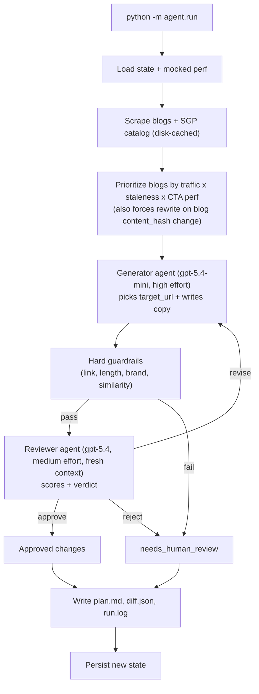

# Blog → SGP Routing Agent

Take-home for the Product Manager, Agentic Growth role at Bold.org.
Recurring-loop agent that, each week, picks the most relevant scholarship page
(SGP) for every Bold blog post and writes a contextual CTA - gated by a
separate reviewer agent and a human-approvable markdown artifact.

Repo: `https://github.com/<owner>/bold-growth-project` _(swap in real URL on push)_

## Problem and why this one

`data.xlsx` (`PAGE_TYPE_FUNNEL`): blogs convert at **0.5%** vs SGPs at
**~15%** - a 30x gap on the highest-impressions surface (1.1M GSC
impressions/month). The single biggest top-of-funnel lever Bold has is
routing blog readers to the right SGP with copy that matches the blog's
intent. See [`thoughts.md`](thoughts.md) for the other nine candidate
opportunities and why this one wins on impact × buildability × reviewer
clarity.

## Why a recurring loop (and not one-shot or event-triggered)

The inputs change every week: new blogs ship, SGPs get refreshed, CTA
performance drifts. A one-shot generator would rot in weeks; an
event-triggered system would only react when something pushes, not when
performance silently sags. A weekly loop with persisted state can rewrite
underperformers, retire dead-end CTAs, and add CTAs for newly-changed blogs
based on hash deltas - exactly the kind of judgmental-but-bounded work an
LLM with a critic handles well.

## Architecture



_Diagram is intentionally high-level. Guardrails fire at four layers
(pre-queue, prompt-level, post-generator, post-reviewer); see the Guardrails
section below for the full list._

## Repo layout

```text
bold-growth-project/
  agent/
    run.py          # CLI + weekly-loop orchestrator
    config.py       # thresholds, model names, banned phrases, cost cap
    scrape.py       # blog + SGP fetchers (requests + bs4), disk-cached
    llm.py          # OpenAI wrapper: JSON-schema outputs + cost meter
    generator.py    # generator agent (picks target_url + writes copy)
    reviewer.py     # reviewer agent (scores + verdict in a fresh context)
    guardrails.py   # all hard rules
    state.py        # atomic JSON state + history
    prioritize.py   # queue selection + decision rules (pure functions)
    artifacts.py    # plan.md (Jinja2) + diff.json + run.log
    prompts/
      generator.md  # PM-facing (edit-safety rules in an HTML comment at the top)
      reviewer.md
  mocks/            # seed blogs, seed catalog, baseline + perf JSON, frozen list
  state/            # cta_state.json + cached HTML
  artifacts/        # week-YYYY-MM-DD/{plan.md, diff.json, run.log}
  sample_output/    # checked-in real outputs from two runs
  tests/            # guardrails, prioritize, state (30 tests)
  design/           # Part 2 + Part 3 deliverables
  pyproject.toml
  README.md
```

## What runs when you `python -m agent.run`

1. Load `state/cta_state.json` (deployed CTAs + history) and the four mock files (baseline, perf, frozen list, plus the two seed lists).
2. Scrape each seed blog and each seed SGP from bold.org (disk-cached - reruns are deterministic).
3. Build the queue: for each blog, decide `add` / `rewrite` / `keep` / `retire` based on (a) whether a CTA exists, (b) whether the blog's `content_hash` changed since deploy, (c) measured CTR vs floor / strong thresholds, (d) consecutive rewrites without lift.
4. Per actionable blog: call the **generator** (`gpt-5.4-mini`, `reasoning_effort=high`) with the blog excerpt + the full catalog as a JSON-schema enum, so the model literally cannot hallucinate a target URL.
5. Run cheap structural guardrails (link resolves, on-domain, length caps, banned phrases, similarity vs current CTA, frozen-list check).
6. If structure passes, call the **reviewer** (`gpt-5.4`, `reasoning_effort=medium`) with a fresh context - no "we just wrote this" framing - and route on its verdict (`approve` / `revise` / `reject`). One revise retry, max.
7. Enforce run-level caps (same-SGP diversity, weekly change limit, reviewer-rejection circuit breaker). Over-cap proposals defer to next week.
8. Persist the new state (atomic write) and emit `plan.md` (the PR a PM approves), `diff.json` (what a real CMS push would consume), and `run.log` (every decision, one JSON line each, for debugging and future eval work).

## How to run it

```bash
python -m venv .venv && source .venv/bin/activate
pip install -e ".[dev]"
cp .env.example .env   # then paste in your OPENAI_API_KEY

python -m agent.run --dry-run                 # smoke the pipeline, no LLM, no writes
python -m agent.run --week 1-2026-05-16       # one weekly run (real LLM calls)
python -m agent.run --simulate-perf           # write deterministic mocked perf
python -m agent.run --week 2-2026-05-23       # second run; loop behaves differently
pytest -q                                     # 30 tests
```

See [`sample_output/`](sample_output/) for two real runs already executed
against bold.org with the real OpenAI API (~$0.26 of LLM spend across both).
Week 2 shows 3 `keep`, 1 `rewrite`, 1 to human review - proof the loop
actually behaves differently the second time.

## Workflow artifact

[`agent/prompts/`](agent/prompts/) IS the workflow-artifact deliverable. A PM
edits those two markdown files to change agent behavior - no Python, no
redeploy. Each prompt opens with a short HTML-comment block of edit-safety
rules. Threshold tuning lives in [`agent/config.py`](agent/config.py)
(intentionally code, since it's policy).

## Guardrails

Four layers, intentionally redundant:

- **Pre-queue**: frozen list (blogs we never touch), `MIN_CTA_AGE_DAYS=7` (don't churn our own work before perf stabilizes)
- **Prompt-level**: banned phrases inlined in the generator prompt; `target_url` schema-enum constrained to the real catalog (hallucinated paths are unrepresentable)
- **Post-generator**: HEAD-request URL check + on-domain check; length caps (70 / 200 chars); banned-phrase post-check; Levenshtein similarity vs current CTA (block no-op rewrites)
- **Post-reviewer**: same-SGP diversity cap (`MAX_PER_SGP=2`), weekly change cap (`MAX_WEEKLY_CHANGES=10`), reviewer-rejection circuit breaker (≥50% rejects on a sample of ≥4 → halt run, flag "drift suspected")
- **Run-level**: hard `$1.00` cost cap (raises `CostCapExceeded`); deterministic via the disk cache

## Riskiest part

The generator picks a wrong-but-plausible SGP and tanks a high-traffic blog.
Mitigations layered: catalog-bounded outputs (schema enum), separate reviewer
in a fresh context, min-age + similarity + diversity + weekly caps, the
human-approvable `plan.md` artifact (nothing auto-ships today), retire-after-3-fails,
the circuit breaker, the cost cap, and the full `run.log` audit trail.

## Trust ladder

1. **Today**: human approves all of `plan.md` before "deploy".
2. **Next**: human still approves `add` + `retire`; `rewrite` of an already-converting
   CTA (CTR ≥ strong) auto-ships.
3. **Later**: fully autonomous on `rewrite`; humans get a weekly digest, not an
   approval gate.

## With another day / week

- Real GA4 + ClickHouse pull instead of mocked `cta_performance.json`
- Real CMS write API (today the diff is the "PR")
- Multi-armed bandit per blog (today: single best variant)
- Expand from 5 seed blogs to all ~100 in `TOP_PUBLIC_LANDING_PAGES`
- An eval set built from captured `run.log` data for reviewer accuracy regression tests
- Annotate live A/B tests so we can sanity-check our CTR floor / strong thresholds against reality

## Out of scope

No real A/B runner (mocked perf), no real CMS push, no vector DB (small catalog
fits in-prompt), no web UI (markdown is enough).

## Part 2 + Part 3 deliverables

Separate from this build, see:

- [`design/part-2-system-a.md`](design/part-2-system-a.md) - second agentic system design
- [`design/part-2-system-b.md`](design/part-2-system-b.md) - third agentic system design (different shape than Part 1)
- [`design/part-3-fake-wins.md`](design/part-3-fake-wins.md) - avoiding fake wins
