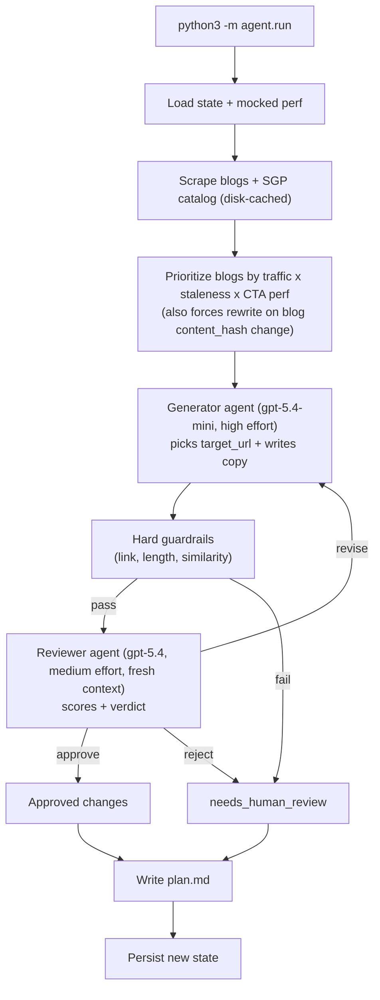

# Blog → SGP Routing Agent (Part 1)

Take-home for the Product Manager, Agentic Growth role at Bold.org. Recurring-loop agent that, each week, picks the most relevant scholarship page (SGP) for every Bold blog post and writes a contextual CTA - gated by a separate reviewer agent and a human-approvable markdown artifact.

Repo: `https://github.com/<owner>/bold-growth-project` *(swap in real URL on push)*

## Problem and why this one

`human/inputs/data.xlsx` (`PAGE_TYPE_FUNNEL`): blogs convert at **0.5%** vs SGPs at **~15%** - a 30x gap on the highest-impressions surface (1.1M GSC impressions/month). Probably the biggest top-of-funnel lever Bold has is routing blog readers to the right SGP with copy that matches the blog's intent. See `[human/research/thoughts.md](human/research/thoughts.md)` for the other nine candidate opportunities.

NOTE: while this has the highest opportunity, it is relatively high effort and low certainty. I chose this, in part, to demonstrate something more interesting and advanced.

## Why a recurring loop

This problem needs iteration, not a one-time rewrite. The agent has to keep testing which CTA copy, reader intent, and destination page actually earn clicks, then rewrite or retire what does not stick.

It also has a moving surface area: new blog posts appear, existing posts change, and new SGPs become available. A recurring loop lets the system keep adding those opportunities to the queue instead of freezing the routing map at one point in time.

## Architecture




## What runs when you `python3 -m agent.run`

1. Load the currently-deployed CTAs and their performance history.
2. Fetch the blogs and SGP catalog from bold.org.
3. Decide what to do with each blog - `add`, `rewrite`, `keep`, or `retire` - based on whether it already has a CTA, whether the blog content changed, how the current CTA is performing, and how many rewrites it has already burned through.
4. For each blog that needs work, the **generator** (`gpt-5.4-mini`) picks a target SGP from the catalog and writes the CTA copy.
5. Run cheap structural checks: link resolves, stays on-domain, fits the length caps, not too similar to the current CTA.
6. If that passes, the **reviewer** (separate agent, `gpt-5.4`) scores the CTA in a fresh context and returns `approve` / `revise` / `reject`. One retry on `revise`, then it goes to human review.
7. Save the new state and write `plan.md` - the PR-style artifact a PM approves.

## How to run it

### Setup

```bash
# create a venv
python3 -m venv .venv
# select that new venv
source .venv/bin/activate
# install the agent and test dependencies
pip install -e ".[dev]"
# paste your key into .env
cp .env.example .env
```

On Windows, use `py` instead of `python3` and activate with `.venv\Scripts\activate`.

### Run it

```bash
python3 -m agent.run --week 1-2026-05-16       # one weekly run (real LLM calls)
python3 -m agent.run --simulate-perf           # write deterministic mocked perf
python3 -m agent.run --week 2-2026-05-23       # second run; loop behaves differently
```

To replay the demo from a clean state, reset generated state and mocked perf first:

```bash
rm -rf state/cta_state.json human/artifacts/  # remove generated state + prior run artifacts
git checkout -- mocks/cta_performance.json    # restore the tracked mock perf file after --simulate-perf overwrites it
```

The date in the `--week` label drives the run clock (e.g. `1-2026-05-16` runs as if today were 2026-05-16 UTC), so the weekly loop is reproducible regardless of wall time.

## Workflow artifacts

### Outputs

Each run writes:

- `human/artifacts/week-<label>/plan.md` - the PR-style artifact a PM approves.
  - Approved CTAs (target SGP + new headline/body) and what they replace
  - Items kept (current CTA is still good enough) and retired (3 failed rewrites in a row)
  - Anything routed to human review, and why
  - Run cost
- `state/cta_state.json` - updated deployed-CTA state + per-blog history (carries into next week's run)

### Prompts

The agent is driven by two prompts a PM owns and edits, plus one config file:

- `[agent/prompts/generator.md](agent/prompts/generator.md)` - tells the generator how to pick a target SGP and write the CTA copy
- `[agent/prompts/reviewer.md](agent/prompts/reviewer.md)` - tells the reviewer how to score relevance + copy quality and when to approve / revise / reject
- Threshold tuning (CTR floor, cost cap, similarity threshold, etc.) lives in `[agent/config.py](agent/config.py)`

## Guardrails

### Script / output guardrails

Four layers, each catching a different failure mode before anything reaches the PM artifact:

- **Prompt-level**: banned phrases inlined in the generator prompt; `target_url` schema-enum constrained to the real catalog (hallucinated paths are unrepresentable)
- **Post-generator**: after the generator writes a CTA, the script checks that the link works, stays on Bold.org, fits the copy limits, and is meaningfully different from the current CTA
- **Post-reviewer**: separate reviewer agent in a fresh context, with an approval floor (`REVIEWER_APPROVAL_FLOOR=0.7`) before anything reaches the PM artifact. Brand safety (banned phrases, hype, false promises) is enforced here.
- **Run-level**: hard `$1.00` cost cap per run

### Analytics / business guardrails

The agent should also prove it is not making the funnel worse. Before expanding rollout, compare edited blogs against the pre-change baseline and a matched / held-out set of similar blogs:

- **Blog CTR regression check**: make sure CTA click-through rate is not getting worse for edited blogs. This is handled in two ways: the weekly agent loop reads performance and can keep / rewrite / retire underperforming CTAs, and a PostHog chart alerts on per-page CTR drops outside the expected band
- **Downstream quality checks**: also monitor SGP submit rate, verified application rate, and D7 activation so the system does not optimize for clicks that turn into lower-quality applicants. This is also a PostHog chart with alerts.
- **Regression rule**: if CTA clicks rise while submit / verify / activation falls, or if any destination page shows a meaningful drop vs baseline, auto-retire the CTA or route it back to human review. Basically, measure e2e (not just the immediate action) for this funnel to check against regression.

## Trust ladder

1. **Today**: human approves all of `plan.md` before "deploy" and only 5 blogs.
2. **Next**: when humans approve 80%, allow it to auto ship itself with humans reading weekly digest. Low confidence score require human review.
3. **Later**: when 80% do not require changes, expand from 5 blogs gradually towards all ~100 in `TOP_PUBLIC_LANDING_PAGES`

NOTE: it's also worth mentioning that most reccuring loop systems should start as a one shot before graduating to recurring.

## With another day / week

- Polish the script with more testing and review
- Polish the prompts (especially for the content it puts together, to align with Bold as a brand)
- Add a third (and maybe fourth) agent (breaking up read, decide, and write)
- Possibly A/B tests on high traffic pages
- Daily check on performance for impacted pages if getting worse (a PostHog chart with alerts)
- Enforce banned phrases and terms in code rather than LLM
- AI eval system to better measure quality and regressions before shipping
  - Ideally this solution would work for many projects
- Add an agent decision tree for future LLM debugging
  - Ideally this solution would work for many projects

## Out of scope for the project

- Real A/B runner (performance is mocked)
- Real CMS push (today the markdown plan is the "PR")
- Production scheduler / hosting (it runs locally as a CLI)
- Live analytics ingestion (GA4 / ClickHouse pulls are mocked)
- Database (the small catalog fits in-prompt)
- Web UI output (currently just outputting in markdown)
- 7-day cooldown filter (removed this for demo purposees, the real thing would wait 7 days before making changes)

## Testing

```bash
python3 -m agent.run --dry-run  # smoke the pipeline end-to-end, no LLM, no writes
pytest -q                       # 21 unit tests (guardrails, prioritize, state)
```

## Other deliverables

For review, the supporting material lives in `human/`:

- `[human/sample-output/](human/sample-output/)` - two real weekly runs against the live API
- `[human/design/part-2-system-a.md](human/design/part-2-system-a.md)` - second agentic system design
- `[human/design/part-2-system-b.md](human/design/part-2-system-b.md)` - third agentic system design
- `[human/design/part-3-fake-wins.md](human/design/part-3-fake-wins.md)` - avoiding fake wins

