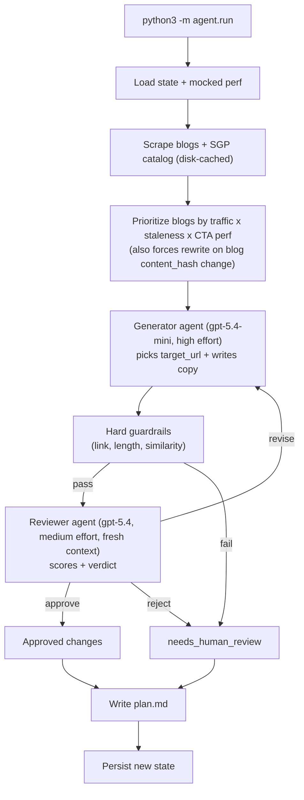

# Blog → SGP Routing Agent

Take-home for the Product Manager, Agentic Growth role at Bold.org. Recurring-loop agent that, each week, picks the most relevant scholarship page (SGP) for every Bold blog post and writes a contextual CTA - gated by a separate reviewer agent and a human-approvable markdown artifact.

Repo: `https://github.com/<owner>/bold-growth-project` *(swap in real URL on push)*

## Problem and why this one

`data.xlsx` (`PAGE_TYPE_FUNNEL`): blogs convert at **0.5%** vs SGPs at **~15%** - a 30x gap on the highest-impressions surface (1.1M GSC impressions/month). Probably the biggest top-of-funnel lever Bold has is routing blog readers to the right SGP with copy that matches the blog's intent. See [`thoughts.md`](thoughts.md) for the other nine candidate opportunities.

## Why a recurring loop

This problem needs iteration, not a one-time rewrite. The agent has to keep testing which CTA copy, reader intent, and destination page actually earn clicks, then rewrite or retire what does not stick.

It also has a moving surface area: new blog posts appear, existing posts change, and new SGPs become available. A recurring loop lets the system keep adding those opportunities to the queue instead of freezing the routing map at one point in time.

## Architecture




## What runs when you `python3 -m agent.run`

1. Load the currently-deployed CTAs and their performance history.
2. Fetch the blogs and SGP catalog from bold.org.
3. Decide what to do with each blog - `add`, `rewrite`, `keep`, or `retire` - based on whether it already has a CTA, whether the blog content changed, how the current CTA is performing, and how many rewrites it has already burned through.
4. For each blog that needs work, the **generator** (`gpt-5.4-mini`) picks a target SGP from the catalog and writes the CTA copy.
5. Run cheap structural checks: link resolves, stays on-domain, fits the length caps, not too similar to the current CTA.
6. If that passes, the **reviewer** (separate agent, `gpt-5.4`) scores the CTA in a fresh context and returns `approve` / `revise` / `reject`. One retry on `revise`, then it goes to human review.
7. Save the new state and write `plan.md` - the PR-style artifact a PM approves.

## How to run it

### Setup

```bash
# create a venv
python3 -m venv .venv
# select that new venv
source .venv/bin/activate
# install the agent and test dependencies
pip install -e ".[dev]"
# paste your key into .env
cp .env.example .env
```

On Windows, use `py` instead of `python3` and activate with `.venv\Scripts\activate`.

### Run it

```bash
python3 -m agent.run --week 1-2026-05-16       # one weekly run (real LLM calls)
python3 -m agent.run --simulate-perf           # write deterministic mocked perf
python3 -m agent.run --week 2-2026-05-23       # second run; loop behaves differently
```

## Workflow artifacts

### Outputs

Each run writes:

- `artifacts/week-<label>/plan.md` - the PR-style artifact a PM approves.
  - Approved CTAs (target SGP + new headline/body) and what they replace.
  - Items kept (current CTA is still good enough) and retired (3 failed rewrites in a row).
  - Anything routed to human review, and why.
  - Run cost: token counts, $ spent, vs. the $1 cap.
- `state/cta_state.json` - updated deployed-CTA state + per-blog history (carries into next week's run).

### Prompts

The agent is driven by two prompts a PM owns and edits, plus one config file:

- [`agent/prompts/generator.md`](agent/prompts/generator.md) - tells the generator how to pick a target SGP and write the CTA copy.
- [`agent/prompts/reviewer.md`](agent/prompts/reviewer.md) - tells the reviewer how to score relevance + copy quality and when to approve / revise / reject.
- Threshold tuning (CTR floor, cost cap, similarity threshold, etc.) lives in [`agent/config.py`](agent/config.py) - intentionally code, since it's policy.

## Guardrails

Five layers, each catching a different failure mode:

- **Pre-generator**: `MIN_CTA_AGE_DAYS=7` (don't churn our own work before perf stabilizes)
- **Prompt-level**: banned phrases inlined in the generator prompt; `target_url` schema-enum constrained to the real catalog (hallucinated paths are unrepresentable)
- **Post-generator**: HEAD-request URL check + on-domain check; length caps (70 / 200 chars); `difflib` similarity vs current CTA (block no-op rewrites)
- **Post-reviewer**: separate reviewer agent in a fresh context, with an approval floor (`REVIEWER_APPROVAL_FLOOR=0.7`) before anything reaches the PM artifact. Brand safety (banned phrases, hype, false promises) is enforced here, not in code
- **Run-level**: hard `$1.00` cost cap (raises `CostCapExceeded`); deterministic via the disk cache

## Trust ladder

1. **Today**: human approves all of `plan.md` before "deploy".
2. **Next**: human still approves `add` + `retire`; `rewrite` of an already-converting CTA (CTR ≥ strong) auto-ships.
3. **Later**: fully autonomous on `rewrite`; humans get a weekly digest, not an approval gate.

## With another day / week

- Real GA4 + ClickHouse pull instead of mocked `cta_performance.json`
- Real CMS write API (today the markdown plan is the "PR")
- Multi-armed bandit per blog (today: single best variant)
- Expand from 5 seed blogs to all ~100 in `TOP_PUBLIC_LANDING_PAGES`
- An eval set built from saved reviewer decisions for reviewer accuracy regression tests
- Annotate live A/B tests so we can sanity-check our CTR floor / strong thresholds against reality

## Out of scope

- Real A/B runner (performance is mocked)
- Real CMS push (today the markdown plan is the "PR")
- Production scheduler / hosting (it runs locally as a CLI)
- Live analytics ingestion (GA4 / ClickHouse pulls are mocked)
- Vector DB (the small catalog fits in-prompt)
- Web UI (markdown is enough)

## Testing

```bash
python3 -m agent.run --dry-run  # smoke the pipeline end-to-end, no LLM, no writes
pytest -q                       # 21 unit tests (guardrails, prioritize, state)
```

## Part 2 + Part 3 deliverables

Separate from this build, see:

- [`design/part-2-system-a.md`](design/part-2-system-a.md) - second agentic system design
- [`design/part-2-system-b.md`](design/part-2-system-b.md) - third agentic system design
- [`design/part-3-fake-wins.md`](design/part-3-fake-wins.md) - avoiding fake wins

